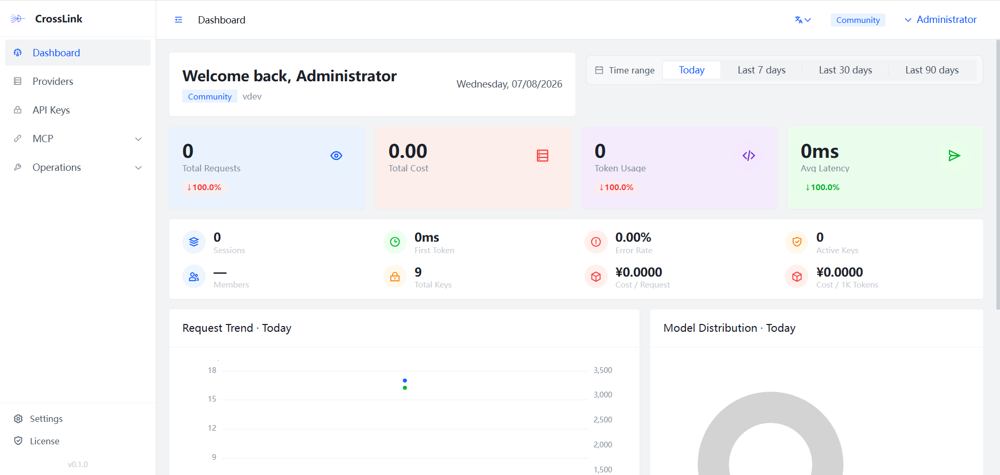
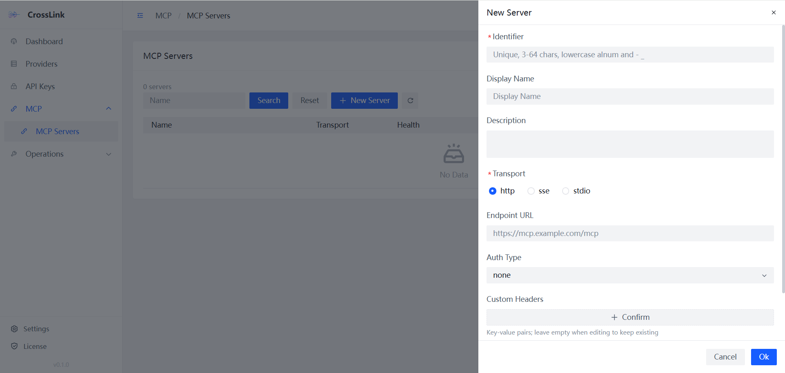
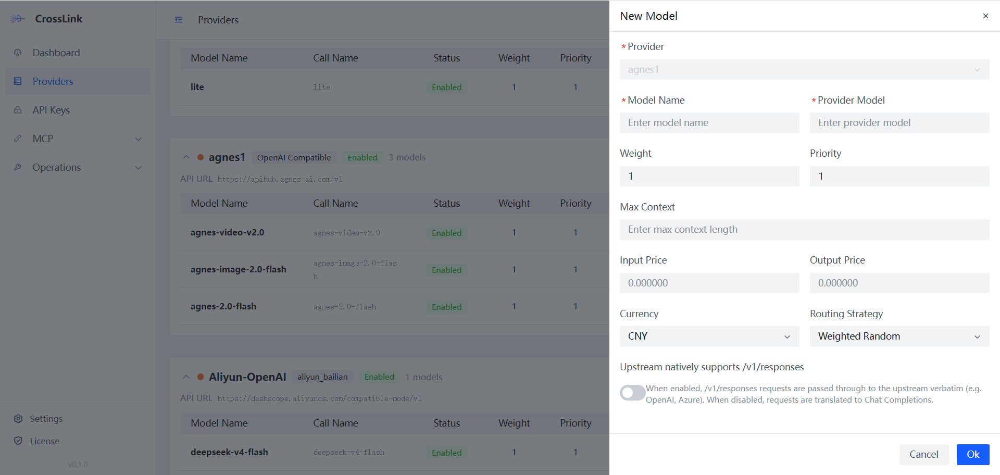

<div align="center">


<br/>


<br/>


<br/>
<br/>

# CrossLink

### One Gateway. Every Model. Zero Lock-in.

**OpenAI & Anthropic Compatible LLM API Gateway**

[English](#quick-start) | [中文](README_zh.md)

A unified proxy with true bidirectional protocol translation, error-classified
failover, an MCP gateway with per-tool RBAC, pluggable guardrails, and a built-in
admin dashboard — for OpenAI, Anthropic, Azure, DeepSeek, Qwen, Ollama, and any
OpenAI-compatible provider.

[Get Started](#quick-start) · [Highlights](#highlights) · [Features](#features) · [Architecture](#architecture) · [Docs](docs/README.md) · [Contributing](CONTRIBUTING.md)

</div>

---

## Why CrossLink?

Every LLM provider has a different API format, auth mechanism, and feature set.
Adapting your code for each one is tedious, error-prone, and locks you in.

CrossLink is a **universal adapter** between your application and any LLM provider:

- **One endpoint** — Your code talks to a single API in either OpenAI or Anthropic format
- **Any provider** — Requests are routed to OpenAI, Anthropic, Azure, DeepSeek, Qwen,
  Ollama, or any OpenAI-compatible service
- **True bidirectional translation** — Full streaming SSE conversion between OpenAI,
  Anthropic, and the OpenAI Responses API, including tool use and extended thinking
- **Resilient by classification** — Failover isn't blind retry. Errors are classified as
  persistent (quota/billing — one strike, long cooldown) or transient (rate limit —
  threshold-based), so retries go where they can actually succeed
- **Observable routing** — Every response carries `x-crosslink-fallback-*` headers, and a
  routing-stats API shows configured-vs-actual traffic distribution so you can see drift

---

## Highlights

What makes CrossLink different — each backed by code, not marketing.

- 🔁 **Bidirectional streaming translation** — OpenAI ↔ Anthropic ↔ Responses API, all three
  directions, via a real state machine (not request-level rewrites). Handles thinking blocks,
  partial-JSON tool args, and token counting mid-stream. → [Architecture](docs/architecture.md)
- 🛡️ **Error-classified failover** — DB-backed rule table distinguishes persistent vs.
  transient failures; half-open single-flight probing prevents stampedes when a flaky
  provider returns. → [Routing & Failover](docs/routing-and-failover.md)
- 🔌 **MCP gateway with per-tool RBAC** — Not a thin proxy. Transport abstraction, tool
  discovery with singleflight caching, encrypted credentials, and allow/deny lists scoped
  by key, team, or role. → [MCP Gateway](docs/mcp-gateway.md)
- 🚧 **Guardrails as a plugin registry** — Plug in any engine (regex, external API, future
  ML) via `RegisterEngine`. Actions: block / log / mask. Per-model config, fail-open or
  fail-closed. → [Architecture](docs/architecture.md)
- 📊 **Routing transparency** — `x-crosslink-fallback-model` / `x-crosslink-fallback-count`
  headers on every response, plus a routing-distribution API showing configured-vs-actual
  weight, deviation, error rate, and latency per provider.
- ❤️‍🩹 **Self-healing dispatch counters** — Per-(provider, model) concurrency/RPM limits via
  Redis Lua with a TTL heartbeat; a crashed process can't leave a provider stuck "busy".
- 🇨🇳 **GM national crypto + air-gapped ready** — SM2/SM3/SM4 mode (including HMAC-SM3 JWT
  signing) and a self-hosted slider CAPTCHA. No reCAPTCHA/hCaptcha dependency — deploys
  fully offline for 信创 compliance. → [Deployment](docs/deployment.md)
- 🎁 **Generous open core** — The Community edition (Apache 2.0) ships 39 actions including
  MCP, RBAC, routing stats, and error rules. Pro adds guardrails/playground/secrets;
  Enterprise adds multi-org, audit, and budgets.

---

## Features

### Core Gateway

- **Dual Protocol** — `/v1/chat/completions` (OpenAI) and `/v1/messages` (Anthropic) with
  automatic bidirectional translation, streaming included
- **Multi-Provider** — OpenAI, Anthropic, Azure OpenAI, DeepSeek, Qwen, Moonshot, Ollama,
  and any OpenAI-compatible provider
- **Intelligent Routing** — 6 strategies: weighted random, round-robin, least latency,
  least cost, least busy, and canary deployment
- **Automatic Failover** — Multi-provider fallback chains with circuit breakers, configurable
  retry policies (exponential/fixed/linear backoff), and error classification
- **Response Caching** — Redis-based caching with per-model TTL, gzip compression, and
  cache key isolation per user

### Security & Control

- **Rate Limiting** — Per-key RPM/TPM limits with global concurrency control (2000)
- **RBAC** — Role-based access control for providers, models, API keys, and MCP
- **Budget Management** — Per-key and per-team budget limits with automatic circuit breaking
- **Guardrails** — Pluggable content-safety engine framework with configurable rules and actions
- **Crypto Flexibility** — Standard (SHA-256/RSA/AES) or Chinese national cryptography (SM3/SM2/SM4)

### Observability

- **Usage Analytics** — Token usage, cost tracking, latency metrics, cache hit rates, and
  fallback/retry counts per request
- **Prometheus Metrics** — Built-in metrics endpoint for monitoring
- **OpenTelemetry** — Distributed tracing support
- **Structured Logging** — JSON logging with request context

### MCP Gateway

- **Model Context Protocol** — HTTP/SSE transport, tool discovery with caching, health checks
- **Permission Management** — Per-principal tool access control (allow/deny by key, team, or role)
- **Call Logging** — Comprehensive tool call logging with monthly partitioning and auto-cleanup

### Operations

- **Vue 3 Admin Dashboard** — Built-in web UI for providers, models, keys, usage, and MCP
  management ([CrossLink-UI-Standard](https://github.com/HotRiceNoodles/CrossLink-UI-Standard))
- **Multi-Instance** — Redis Pub/Sub for provider registry sync and distributed round-robin
- **Graceful Shutdown** — 5-phase drain: in-flight SSE streams → HTTP shutdown → worker flush →
  background goroutine cancellation → DB cleanup
- **One-Command Deploy** — Docker Compose spins up gateway, frontend, PostgreSQL, and Redis in one command

---

## Architecture

<p align="center">
  
</p>

See [Architecture](docs/architecture.md) for the request flow, the streaming translator
state machine, the fallback engine's timeout budgeting, and the 5-phase graceful shutdown.

---

## Dashboard Preview

<p align="center">
  
</p>
<p align="center"><em>The admin dashboard: request volume, cost, token usage, latency, error rate, and model distribution at a glance.</em></p>

<p align="center">
  
</p>
<p align="center"><em>MCP server management: registry with transport types (HTTP/SSE/stdio), health status, and per-server configuration.</em></p>

<p align="center">
  
</p>
<p align="center"><em>Provider & model configuration: weight, priority, pricing, and routing strategy per model.</em></p>

---

## Quick Start

### Prerequisites

- Go 1.22+ (building from source)
- PostgreSQL 14+
- Redis 7+

### Docker Compose (Recommended)

Frontend ([CrossLink-UI-Standard](https://github.com/HotRiceNoodles/CrossLink-UI-Standard)) and backend are built together. One command starts everything:

```bash
git clone https://github.com/HotRiceNoodles/CrossLink.git
cd CrossLink
docker compose -f deployments/docker-compose.dev.yaml up --build
```

Frontend dashboard and API gateway are available at `http://localhost` (port 80).

> **China network?** Use `docker compose -f deployments/docker-compose.cn.yaml up --build` with Go and npm mirrors pre-configured.

### Build from Source

```bash
git clone https://github.com/HotRiceNoodles/CrossLink.git
cd CrossLink
cp configs/config.example.yaml configs/config.yaml
# Edit config.yaml with your database and Redis settings
make build
./bin/crosslink
```

### Make Your First Request

Create an API key via the admin dashboard (`http://localhost:8080`), then try it in 30 seconds:

```bash
curl http://localhost:8080/v1/chat/completions \
  -H "Authorization: Bearer cl-your-api-key" \
  -H "Content-Type: application/json" \
  -d '{
    "model": "deepseek-chat",
    "messages": [{"role": "user", "content": "Hello!"}]
  }'
```

**OpenAI SDK (Python)**

```python
from openai import OpenAI

client = OpenAI(
    base_url="http://localhost:8080/v1",
    api_key="cl-your-api-key"
)

response = client.chat.completions.create(
    model="deepseek-chat",
    messages=[{"role": "user", "content": "Hello!"}]
)
print(response.choices[0].message.content)
```

**Anthropic SDK (Python)**

```python
import anthropic

client = anthropic.Anthropic(
    base_url="http://localhost:8080",
    api_key="cl-your-api-key"
)

message = client.messages.create(
    model="claude-sonnet-4-20250514",
    max_tokens=1024,
    messages=[{"role": "user", "content": "Hello!"}]
)
print(message.content[0].text)
```

---

## Configuration

All configuration lives in `configs/config.yaml`. Every value can be overridden with
environment variables using the `CL_` prefix (e.g., `CL_DATABASE_HOST`, `CL_REDIS_PORT`).

```yaml
server:
  port: 8080
  read_timeout: 30s
  write_timeout: 120s

database:
  host: localhost
  port: 5432
  user: crosslink
  password: crosslink
  dbname: crosslink
  sslmode: disable

redis:
  host: localhost
  port: 6379

gateway:
  auth_key: "cl-change-me"

admin:
  username: admin
  password: changeme
  jwt_secret: "change-me-to-a-random-secret"

cache:
  enabled: true
  default_ttl: 5m

mcp:
  enabled: true
  health_check_interval: 30s

crypto:
  mode: standard    # standard (SHA-256/RSA/AES) or gm (SM3/SM2/SM4)
```

### Provider Seeding

Providers are seeded from `configs/providers.yaml` on first run:

```yaml
providers:
  - name: deepseek
    adapter_type: openai_compatible
    base_url: https://api.deepseek.com/v1
    api_key: ${DEEPSEEK_API_KEY}
    models:
      - name: deepseek-chat
        provider_model: deepseek-chat
```

---

## API Endpoints

### Gateway (API Key Required)

| Method | Path | Description |
|--------|------|-------------|
| `POST` | `/v1/chat/completions` | OpenAI-compatible chat (stream & non-stream) |
| `POST` | `/v1/messages` | Anthropic-compatible messages (stream & non-stream) |
| `GET` | `/v1/models` | List available models |

### MCP Gateway

| Method | Path | Description |
|--------|------|-------------|
| `POST` | `/mcp/:server` | MCP JSON-RPC forwarding |
| `GET` | `/mcp/:server` | MCP SSE transport |

### Admin (JWT Required)

| Method | Path | Description |
|--------|------|-------------|
| `POST` | `/admin/api/auth/login` | Login |
| `CRUD` | `/admin/api/providers` | Provider management (test via `POST /:id/test`) |
| `CRUD` | `/admin/api/models` | Model mapping management |
| `CRUD` | `/admin/api/keys` | API key management (regenerate via `POST /:id/regenerate`) |
| `GET` | `/admin/api/usage` | Usage logs with multi-dimensional filtering |
| `GET` | `/admin/api/routing/stats` | Routing distribution: configured vs. actual per provider |
| `CRUD` | `/admin/api/mcp/servers` | MCP server management |
| `GET` | `/admin/api/mcp/servers/:id/tools` | List tools on MCP server |

The full API reference — including request/response shapes, error codes, and the
`x-crosslink-fallback-*` response headers — is in [docs/api-reference.md](docs/api-reference.md).

---

## Deployment

### Production Docker Compose

```bash
docker compose -f deployments/docker-compose.prod.yaml up -d --build
```

### China Network

Use the CN variant with Go proxy (`goproxy.cn`) and npm mirror (`registry.npmmirror.com`):

```bash
docker compose -f deployments/docker-compose.cn.yaml up --build
```

### Nginx · Caddy · Systemd · GM

Production-ready Nginx config (TLS, security headers, SSE streaming) at
`deployments/nginx/`, a Caddyfile for automatic HTTPS, a systemd unit, and a dedicated
GM (SM2/SM3/SM4) deployment with GmSSL/Nginx + TLCP at `deployments/gm/`.

→ See [Deployment](docs/deployment.md) for all options and multi-instance scaling notes.

---

## Documentation

- [Architecture](docs/architecture.md) — request flow, translator state machine, fallback engine
- [Routing & Failover](docs/routing-and-failover.md) — strategies, circuit breaker, error classification
- [MCP Gateway](docs/mcp-gateway.md) — transport, per-tool RBAC, encrypted credentials
- [API Reference](docs/api-reference.md) — full endpoint reference
- [Deployment](docs/deployment.md) — all deployment variants

---

## Roadmap

CrossLink is under active development. Current focus:

- [x] Provider guardrails with health-aware routing
- [x] Routing-distribution observability (`/admin/api/routing/stats`)
- [x] Self-healing concurrency counters (TTL heartbeat)
- [x] OpenAI Responses API translation (stream + non-stream)
- [x] Self-hosted slider CAPTCHA (air-gapped ready)
- [ ] Provider guard alert rules (Enterprise) — in progress
- [ ] Expanded guardrail engine ecosystem (ML-based classifiers)
- [ ] Multi-team budgets and audit (Enterprise)

Have a request? Open a [Discussion](https://github.com/HotRiceNoodles/CrossLink/discussions) or a [feature request](https://github.com/HotRiceNoodles/CrossLink/issues/new/choose).

---

## Community & Support

- 💬 **Questions & ideas** — [GitHub Discussions](https://github.com/HotRiceNoodles/CrossLink/discussions)
- 🐛 **Bug reports** — [open an issue](https://github.com/HotRiceNoodles/CrossLink/issues/new/choose) (use the bug-report template)
- 🔒 **Security reports** — see [SECURITY.md](SECURITY.md) for private disclosure
- ⭐ **Like the project?** Give it a star — it helps others find CrossLink.

---

## Contributing

We welcome contributions of all sizes — bug fixes, features, docs, or ideas.

1. Fork the repository
2. Create a feature branch (`git checkout -b feature/my-feature`)
3. Commit your changes (`git commit -m 'Add some feature'`)
4. Push to the branch (`git push origin feature/my-feature`)
5. Open a Pull Request

See [CONTRIBUTING.md](CONTRIBUTING.md) for detailed guidelines.

### Development

```bash
make build          # Build binary (bin/crosslink)
make run            # Run the server
make test           # Run all tests
make lint           # Run golangci-lint
make clean          # Remove build artifacts
```

---

## Security

See [SECURITY.md](SECURITY.md) for our security policy and vulnerability reporting instructions.

---

## Star History

[](https://star-history.com/#HotRiceNoodles/CrossLink&Date)

---

## License

[Apache License 2.0](LICENSE)
