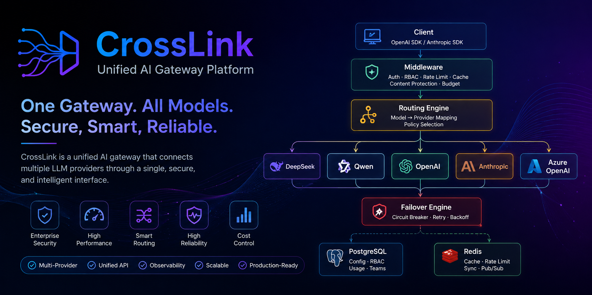
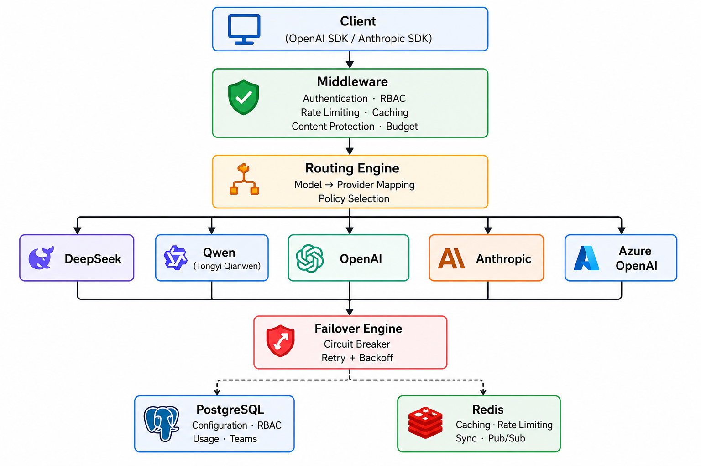

<div align="center">



<br/>


<br/>
<br/>

# CrossLink

### One Gateway. Every Model. Zero Lock-in.

**OpenAI & Anthropic Compatible LLM API Gateway**

[English](#quick-start) | [中文](README_zh.md)

Unified proxy with intelligent routing, automatic failover, protocol translation,
rate limiting, caching, MCP gateway, and a built-in admin dashboard.

[Get Started](#quick-start) · [Features](#features) · [Architecture](#architecture) · [API Docs](#api-endpoints) · [Contributing](CONTRIBUTING.md)

</div>

---

## Why CrossLink?

Every LLM provider has a different API format, auth mechanism, and feature set.
Adapting your code for each one is tedious, error-prone, and locks you in.

CrossLink solves this by acting as a **universal adapter** between your application and
any LLM provider:

- **One endpoint** — Your code talks to a single API in either OpenAI or Anthropic format
- **Any provider** — Requests are routed to OpenAI, Anthropic, Azure, DeepSeek, Qwen,
  Ollama, or any OpenAI-compatible service
- **Automatic translation** — Full bidirectional protocol conversion including streaming SSE,
  tool use, and extended thinking
- **Resilient by default** — Circuit breakers, fallback chains, and retry policies keep your
  application running when providers don't

---

## Features

### Core Gateway

- **Dual Protocol** — Exposes both `/v1/chat/completions` (OpenAI) and `/v1/messages` (Anthropic)
  endpoints with automatic bidirectional translation
- **Multi-Provider** — Route to OpenAI, Anthropic, Azure OpenAI, DeepSeek, Qwen, Moonshot, Ollama,
  and any OpenAI-compatible provider
- **Intelligent Routing** — 6 strategies: weighted random, round-robin, least latency, least cost,
  least busy, and canary deployment
- **Automatic Failover** — Multi-provider fallback chains with circuit breakers, configurable retry
  policies (exponential/fixed/linear backoff), and error classification
- **Response Caching** — Redis-based caching with per-model TTL, gzip compression, and
  cache key isolation per user

### Security & Control

- **Rate Limiting** — Per-key RPM/TPM limits with global concurrency control (2000)
- **RBAC** — Role-based access control for providers, models, API keys, and MCP
- **Budget Management** — Per-key and per-team budget limits with automatic circuit breaking
- **Guardrails** — Content safety engine framework with configurable rules and actions
- **Crypto Flexibility** — Standard (SHA-256/RSA/AES) or Chinese national cryptography (SM3/SM2/SM4)

### Observability

- **Usage Analytics** — Token usage, cost tracking, latency metrics, cache hit rates, and
  fallback/retry counts per request
- **Prometheus Metrics** — Built-in metrics endpoint for monitoring
- **OpenTelemetry** — Distributed tracing support
- **Structured Logging** — JSON logging with request context

### MCP Gateway

- **Model Context Protocol** — HTTP/SSE transport, tool discovery with caching, health checks
- **Permission Management** — Per-principal tool access control (allow/deny by key, team, or role)
- **Call Logging** — Comprehensive tool call logging with monthly partitioning and auto-cleanup

### Operations

- **Vue 3 Admin Dashboard** — Built-in web UI for providers, models, keys, usage, and MCP
  management ([CrossLink-UI-Standard](https://github.com/HotRiceNoodles/CrossLink-UI-Standard))
- **Multi-Instance** — Redis Pub/Sub for provider registry sync and distributed round-robin
- **Graceful Shutdown** — 4-phase drain: in-flight SSE streams → HTTP shutdown → worker flush →
  background goroutine cancellation
- **One-Command Deploy** — Docker Compose spins up gateway, frontend, PostgreSQL, and Redis in one command

---

## Architecture

<p align="center">
  
</p>

---

## Quick Start

### Prerequisites

- Go 1.22+ (building from source)
- PostgreSQL 14+
- Redis 7+

### Docker Compose (Recommended)

Frontend ([CrossLink-UI-Standard](https://github.com/HotRiceNoodles/CrossLink-UI-Standard)) and backend are built together. One command starts everything:

```bash
git clone https://github.com/HotRiceNoodles/CrossLink.git
cd CrossLink
docker compose -f deployments/docker-compose.dev.yaml up --build
```

Frontend dashboard and API gateway are available at `http://localhost` (port 80).

> **China network?** Use `docker compose -f deployments/docker-compose.cn.yaml up --build` with Go and npm mirrors pre-configured.

### Build from Source

```bash
git clone https://github.com/HotRiceNoodles/CrossLink.git
cd CrossLink
cp configs/config.example.yaml configs/config.yaml
# Edit config.yaml with your database and Redis settings
make build
./bin/crosslink
```

### Make Your First Request

Create an API key via the admin dashboard (`http://localhost:8080`), then:

**OpenAI SDK (Python)**

```python
from openai import OpenAI

client = OpenAI(
    base_url="http://localhost:8080/v1",
    api_key="cl-your-api-key"
)

response = client.chat.completions.create(
    model="deepseek-chat",
    messages=[{"role": "user", "content": "Hello!"}]
)
print(response.choices[0].message.content)
```

**Anthropic SDK (Python)**

```python
import anthropic

client = anthropic.Anthropic(
    base_url="http://localhost:8080",
    api_key="cl-your-api-key"
)

message = client.messages.create(
    model="claude-sonnet-4-20250514",
    max_tokens=1024,
    messages=[{"role": "user", "content": "Hello!"}]
)
print(message.content[0].text)
```

**curl**

```bash
curl http://localhost:8080/v1/chat/completions \
  -H "Authorization: Bearer cl-your-api-key" \
  -H "Content-Type: application/json" \
  -d '{
    "model": "deepseek-chat",
    "messages": [{"role": "user", "content": "Hello!"}]
  }'
```

---

## Configuration

All configuration lives in `configs/config.yaml`. Every value can be overridden with
environment variables using the `CL_` prefix (e.g., `CL_DATABASE_HOST`, `CL_REDIS_PORT`).

```yaml
server:
  port: 8080
  read_timeout: 30s
  write_timeout: 120s

database:
  host: localhost
  port: 5432
  user: crosslink
  password: crosslink
  dbname: crosslink
  sslmode: disable

redis:
  host: localhost
  port: 6379

gateway:
  auth_key: "cl-change-me"

admin:
  username: admin
  password: changeme
  jwt_secret: "change-me-to-a-random-secret"

cache:
  enabled: true
  default_ttl: 5m

mcp:
  enabled: true
  health_check_interval: 30s

crypto:
  mode: standard    # standard (SHA-256/RSA/AES) or gm (SM3/SM2/SM4)
```

### Provider Seeding

Providers are seeded from `configs/providers.yaml` on first run:

```yaml
providers:
  - name: deepseek
    adapter_type: openai_compatible
    base_url: https://api.deepseek.com/v1
    api_key: ${DEEPSEEK_API_KEY}
    models:
      - name: deepseek-chat
        provider_model: deepseek-chat
```

---

## API Endpoints

### Gateway (API Key Required)

| Method | Path | Description |
|--------|------|-------------|
| `POST` | `/v1/chat/completions` | OpenAI-compatible chat (stream & non-stream) |
| `POST` | `/v1/messages` | Anthropic-compatible messages (stream & non-stream) |
| `GET` | `/v1/models` | List available models |

### MCP Gateway

| Method | Path | Description |
|--------|------|-------------|
| `POST` | `/mcp/:server` | MCP JSON-RPC forwarding |
| `GET` | `/mcp/:server` | MCP SSE transport |

### Admin (JWT Required)

| Method | Path | Description |
|--------|------|-------------|
| `POST` | `/admin/api/auth/login` | Login |
| `CRUD` | `/admin/api/providers` | Provider management (test via `POST /:id/test`) |
| `CRUD` | `/admin/api/models` | Model mapping management |
| `CRUD` | `/admin/api/keys` | API key management (regenerate via `POST /:id/regenerate`) |
| `GET` | `/admin/api/usage` | Usage logs with multi-dimensional filtering |
| `GET` | `/admin/api/usage/stats` | Usage statistics |
| `GET` | `/admin/api/usage/daily` | Daily usage trends |
| `CRUD` | `/admin/api/mcp/servers` | MCP server management |
| `GET` | `/admin/api/mcp/servers/:id/tools` | List tools on MCP server |

Full API reference is available in the [documentation](docs/).

---

## Deployment

### Production Docker Compose

```bash
docker compose -f deployments/docker-compose.prod.yaml up -d --build
```

### China Network

Use the CN variant with Go proxy (`goproxy.cn`) and npm mirror (`registry.npmmirror.com`):

```bash
docker compose -f deployments/docker-compose.cn.yaml up --build
```

### Nginx

Production-ready Nginx config with TLS, security headers, and SSE streaming support:
`deployments/nginx/crosslink.conf`

### Systemd

```bash
sudo cp deployments/systemd/crosslink.service /etc/systemd/system/
sudo systemctl enable --now crosslink
```

### GM (Chinese National Cryptography)

For SM2/SM3/SM4 compliance, a dedicated deployment with GmSSL/Nginx and TLCP protocol
support is available at `deployments/gm/`.

---

## Contributing

We welcome contributions of all sizes — bug fixes, features, docs, or ideas.

1. Fork the repository
2. Create a feature branch (`git checkout -b feature/my-feature`)
3. Commit your changes (`git commit -m 'Add some feature'`)
4. Push to the branch (`git push origin feature/my-feature`)
5. Open a Pull Request

See [CONTRIBUTING.md](CONTRIBUTING.md) for detailed guidelines.

### Development

```bash
make build          # Build binary (bin/crosslink)
make run            # Run the server
make test           # Run all tests
make lint           # Run golangci-lint
make clean          # Remove build artifacts
```

---

## Security

See [SECURITY.md](SECURITY.md) for our security policy and vulnerability reporting instructions.

---

## Star History

[](https://star-history.com/#HotRiceNoodles/CrossLink&Date)

---

## License

[Apache License 2.0](LICENSE)
