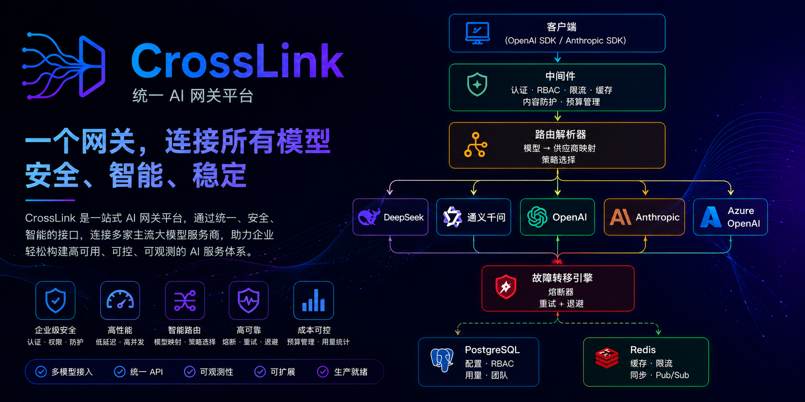
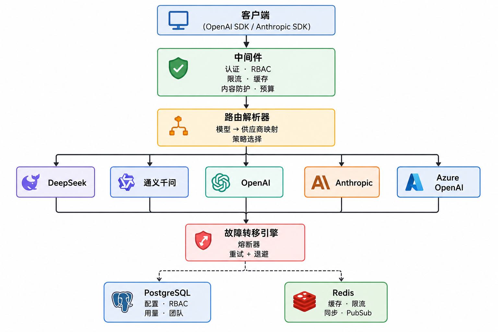
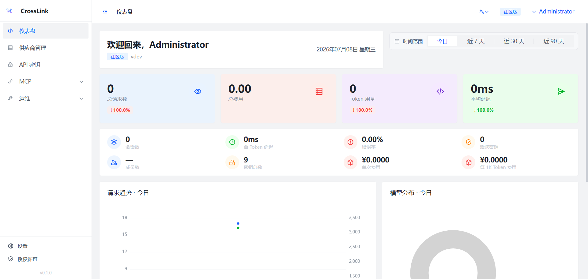
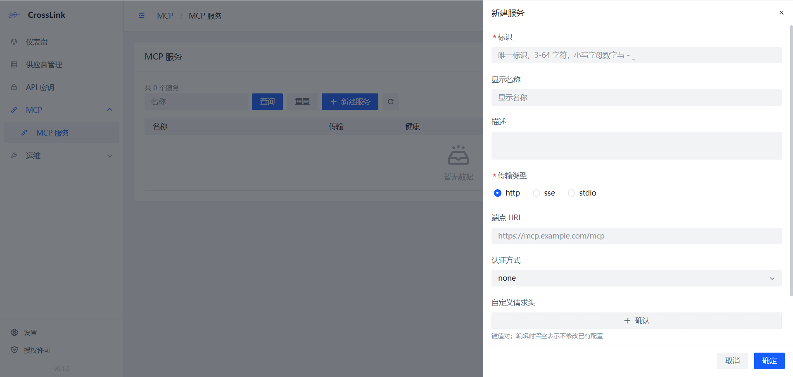
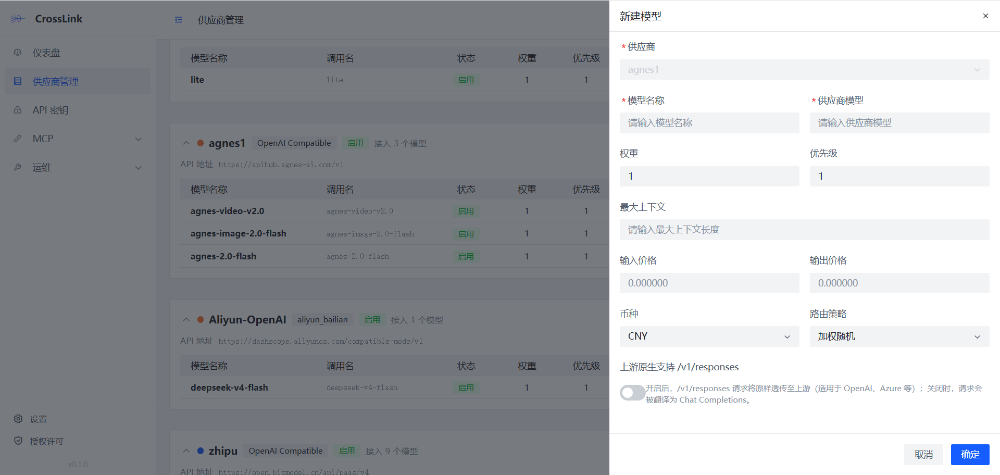

<div align="center">



<br/>


<br/>


<br/>
<br/>

# CrossLink 搭桥

### 一个网关，调度全球最强模型，零厂商锁定

**OpenAI & Anthropic 兼容 LLM API 网关**

[English](README.md) | [中文](#快速开始)

真·双向协议翻译、错误分类容灾、带 per-tool RBAC 的 MCP 网关、可插拔护栏、内置
管理后台——覆盖 OpenAI、Anthropic、Azure、DeepSeek、通义千问、Ollama 及任意
OpenAI 兼容供应商。

[快速开始](#快速开始) · [核心亮点](#核心亮点) · [功能特性](#功能特性) · [架构](#架构) · [文档](docs/README.md) · [参与贡献](CONTRIBUTING.md)

</div>

---

## 为什么选择 CrossLink？

每家 LLM 供应商的 API 格式、认证方式、功能特性各不相同。
每接入一个新模型，就要重写一遍适配代码——既繁琐又容易出错，还让你被厂商牢牢锁死。

CrossLink 充当你应用与任意 LLM 供应商之间的**万能转接头**：

- **统一入口** — 你的代码只需对接一个 API，OpenAI 或 Anthropic 格式任选
- **任意供应商** — 请求被智能路由到 OpenAI、Anthropic、Azure、DeepSeek、通义千问、
  Ollama 或任何 OpenAI 兼容服务
- **真·双向翻译** — OpenAI、Anthropic、OpenAI Responses API 三者之间完整的流式
  SSE 转换，覆盖 Tool Use 与 Extended Thinking
- **按错误分类容灾** — 故障转移不是盲目重试。错误被分为持久性（配额/计费——一票
  出局、长冷却）与瞬时性（限流——阈值触发），重试只花在能成功的地方
- **路由可观测** — 每个响应都带 `x-crosslink-fallback-*` 头，路由统计 API 展示
  配置权重与实际流量的偏差，漂移一眼可见

---

## 核心亮点

CrossLink 的差异化——每一条都有代码支撑，不是营销话术。

- 🔁 **双向流式翻译** — OpenAI ↔ Anthropic ↔ Responses API 三个方向，由真正的状态
  机实现（非请求级重写）。处理 thinking 块、流式 JSON 工具参数、token 计数。
  → [架构](docs/architecture.md)
- 🛡️ **错误分类容灾** — DB 规则表区分持久性 vs 瞬时性失败；半开单飞探测
  （half-open single-flight）防止供应商恢复时的惊群。→ [路由与容灾](docs/routing-and-failover.md)
- 🔌 **带 per-tool RBAC 的 MCP 网关** — 不是简单代理。传输抽象、singleflight 缓存的
  工具发现、加密凭据、按 Key/团队/角色的 allow/deny 名单。→ [MCP 网关](docs/mcp-gateway.md)
- 🚧 **护栏即插件注册表** — 通过 `RegisterEngine` 接入任意引擎（正则、外部 API、
  未来 ML 引擎）。动作：block / log / mask。按模型配置，可 fail-open 或 fail-closed。
  → [架构](docs/architecture.md)
- 📊 **路由透明** — 每个响应带 `x-crosslink-fallback-model` / `x-crosslink-fallback-count`
  头，外加路由分布 API，按供应商展示配置 vs 实际权重、偏差、错误率、延迟。
- ❤️‍🩹 **自愈分发计数器** — 按 (供应商, 模型) 的并发/RPM 限制基于 Redis Lua + TTL
  心跳；进程崩溃不会让某个供应商永久卡在"忙碌"状态。
- 🇨🇳 **国密 + 可离线部署** — SM2/SM3/SM4 模式（含 HMAC-SM3 JWT 签名）与自托管滑块
  验证码。无 reCAPTCHA/hCaptcha 依赖——可完全离线部署，满足信创合规。
  → [部署](docs/deployment.md)
- 🎁 **慷慨的开源核心** — Community 版（Apache 2.0）含 39 项动作，覆盖 MCP、RBAC、
  路由统计、错误规则。Pro 增加护栏/Playground/密钥管理；Enterprise 增加多组织、
  审计、预算。

---

## 功能特性

### 核心网关

- **双协议** — 同时暴露 `/v1/chat/completions`（OpenAI）和 `/v1/messages`（Anthropic）
  端点，自动双向协议转换，含流式
- **多供应商** — 路由到 OpenAI、Anthropic、Azure OpenAI、DeepSeek、通义千问、Moonshot、
  Ollama 及任意 OpenAI 兼容供应商
- **智能路由** — 6 种策略：加权随机、轮询、最低延迟、最低成本、最空闲、金丝雀发布
- **自动容灾** — 多供应商故障转移链，配合熔断器、可配置重试策略（指数/固定/线性退避）
  和错误分类
- **响应缓存** — 基于 Redis 的缓存，按模型设置 TTL、gzip 压缩、按用户隔离缓存键

### 安全与管控

- **限流** — 按 API Key 设置 RPM/TPM 限制，全局并发控制（2000）
- **RBAC 权限** — 基于角色的访问控制，覆盖供应商、模型、API Key 和 MCP
- **预算管理** — 按 Key 和按团队的预算上限，超支自动熔断
- **内容防护** — 可插拔的内容安全引擎框架，支持自定义规则和动作
- **国密支持** — 支持国际标准（SHA-256/RSA/AES）和国密算法（SM3/SM2/SM4）

### 可观测性

- **用量分析** — 每次请求自动记录 Token 用量、成本、延迟、缓存命中率和故障转移/重试次数
- **Prometheus 指标** — 内置 metrics 端点
- **OpenTelemetry** — 分布式链路追踪
- **结构化日志** — 带请求上下文的 JSON 日志

### MCP 网关

- **Model Context Protocol** — HTTP/SSE 传输、工具发现与缓存、健康检查
- **权限管理** — 按主体（Key / 团队 / 角色）的工具访问控制
- **调用日志** — 完整的工具调用日志，按月分区，自动清理

### 运维管理

- **Vue 3 管理后台** — 内置 Web 管理界面，供应商、模型、Key、用量、MCP 一站式管理
  （[CrossLink-UI-Standard](https://github.com/HotRiceNoodles/CrossLink-UI-Standard)）
- **多实例部署** — Redis Pub/Sub 供应商注册同步、分布式轮询
- **优雅关闭** — 5 阶段排空：SSE 流排空 → HTTP 关闭 → Worker 刷盘 → 后台协程取消 →
  DB 清理
- **一键部署** — Docker Compose 一键启动网关、前端、PostgreSQL、Redis

---

## 架构

<p align="center">
  
</p>

请求流、流式翻译状态机、FallbackEngine 超时预算与 5 阶段优雅退出，详见
[架构文档](docs/architecture.md)。

---

## 后台预览

<p align="center">
  
</p>
<p align="center"><em>管理总览：请求量、成本、Token 用量、延迟、错误率与模型分布一目了然。</em></p>

<p align="center">
  
</p>
<p align="center"><em>MCP 服务管理：注册表、传输类型（HTTP/SSE/stdio）、健康状态与按服务配置。</em></p>

<p align="center">
  
</p>
<p align="center"><em>供应商与模型配置：按模型设置权重、优先级、定价与路由策略。</em></p>

---

## 快速开始

### 前置要求

- Go 1.22+（源码编译）
- PostgreSQL 14+
- Redis 7+

### Docker Compose（推荐）

前端（[CrossLink-UI-Standard](https://github.com/HotRiceNoodles/CrossLink-UI-Standard)）和后端自动从 GitHub 拉取并构建，一条命令启动全部服务：

```bash
git clone https://github.com/HotRiceNoodles/CrossLink.git
cd CrossLink
docker compose -f deployments/docker-compose.dev.yaml up --build
```

前端管理后台和 API 网关统一入口：`http://localhost`（端口 80）。

> **国内网络？** 使用 `docker compose -f deployments/docker-compose.cn.yaml up --build`，已预配置 Go 和 npm 国内镜像。

### 源码编译

```bash
git clone https://github.com/HotRiceNoodles/CrossLink.git
cd CrossLink
cp configs/config.example.yaml configs/config.yaml
# 编辑 config.yaml，填入数据库和 Redis 连接信息
make build
./bin/crosslink
```

### 发起第一次请求

通过管理后台（`http://localhost:8080`）创建 API Key，然后 30 秒体验：

```bash
curl http://localhost:8080/v1/chat/completions \
  -H "Authorization: Bearer cl-your-api-key" \
  -H "Content-Type: application/json" \
  -d '{
    "model": "deepseek-chat",
    "messages": [{"role": "user", "content": "你好！"}]
  }'
```

**OpenAI SDK（Python）**

```python
from openai import OpenAI

client = OpenAI(
    base_url="http://localhost:8080/v1",
    api_key="cl-your-api-key"
)

response = client.chat.completions.create(
    model="deepseek-chat",
    messages=[{"role": "user", "content": "你好！"}]
)
print(response.choices[0].message.content)
```

**Anthropic SDK（Python）**

```python
import anthropic

client = anthropic.Anthropic(
    base_url="http://localhost:8080",
    api_key="cl-your-api-key"
)

message = client.messages.create(
    model="claude-sonnet-4-20250514",
    max_tokens=1024,
    messages=[{"role": "user", "content": "你好！"}]
)
print(message.content[0].text)
```

---

## 配置

所有配置位于 `configs/config.yaml`，每项均可通过 `CL_` 前缀的环境变量覆盖（如 `CL_DATABASE_HOST`、`CL_REDIS_PORT`）。

```yaml
server:
  port: 8080
  read_timeout: 30s
  write_timeout: 120s

database:
  host: localhost
  port: 5432
  user: crosslink
  password: crosslink
  dbname: crosslink
  sslmode: disable

redis:
  host: localhost
  port: 6379

gateway:
  auth_key: "cl-change-me"

admin:
  username: admin
  password: changeme
  jwt_secret: "change-me-to-a-random-secret"

cache:
  enabled: true
  default_ttl: 5m

mcp:
  enabled: true
  health_check_interval: 30s

crypto:
  mode: standard    # standard (SHA-256/RSA/AES) 或 gm (SM3/SM2/SM4)
```

### 供应商初始化

首次启动时从 `configs/providers.yaml` 加载供应商配置：

```yaml
providers:
  - name: deepseek
    adapter_type: openai_compatible
    base_url: https://api.deepseek.com/v1
    api_key: ${DEEPSEEK_API_KEY}
    models:
      - name: deepseek-chat
        provider_model: deepseek-chat
```

---

## API 端点

### 网关接口（需 API Key）

| 方法 | 路径 | 说明 |
|--------|------|-------------|
| `POST` | `/v1/chat/completions` | OpenAI 兼容对话（流式 & 非流式） |
| `POST` | `/v1/messages` | Anthropic 兼容消息（流式 & 非流式） |
| `GET` | `/v1/models` | 获取可用模型列表 |

### MCP 网关

| 方法 | 路径 | 说明 |
|--------|------|-------------|
| `POST` | `/mcp/:server` | MCP JSON-RPC 转发 |
| `GET` | `/mcp/:server` | MCP SSE 传输 |

### 管理接口（需 JWT）

| 方法 | 路径 | 说明 |
|--------|------|-------------|
| `POST` | `/admin/api/auth/login` | 登录 |
| `CRUD` | `/admin/api/providers` | 供应商管理（通过 `POST /:id/test` 测试连通性） |
| `CRUD` | `/admin/api/models` | 模型映射管理 |
| `CRUD` | `/admin/api/keys` | API Key 管理（通过 `POST /:id/regenerate` 重新生成） |
| `GET` | `/admin/api/usage` | 用量日志，支持多维度筛选 |
| `GET` | `/admin/api/routing/stats` | 路由分布：按供应商对比配置与实际权重 |
| `CRUD` | `/admin/api/mcp/servers` | MCP 服务管理 |
| `GET` | `/admin/api/mcp/servers/:id/tools` | MCP 服务工具列表 |

完整 API 文档——含请求/响应结构、错误码与 `x-crosslink-fallback-*` 响应头——见
[docs/api-reference.md](docs/api-reference.md)。

---

## 部署

### 生产环境 Docker Compose

```bash
docker compose -f deployments/docker-compose.prod.yaml up -d --build
```

### 国内网络加速

使用 CN 变体，已配置 Go 代理（`goproxy.cn`）和 npm 镜像（`registry.npmmirror.com`）：

```bash
docker compose -f deployments/docker-compose.cn.yaml up --build
```

### Nginx · Caddy · Systemd · 国密

生产就绪的 Nginx 配置（TLS、安全头、SSE 流式支持）位于 `deployments/nginx/`，
Caddyfile 提供 HTTPS 自动签发，systemd unit 用于裸机部署，国密（SM2/SM3/SM4）
专用部署含 GmSSL/Nginx + TLCP 位于 `deployments/gm/`。

→ 全部部署方式与多实例扩展说明见 [部署文档](docs/deployment.md)。

---

## 文档

- [架构](docs/architecture.md) — 请求流、翻译器状态机、FallbackEngine
- [路由与容灾](docs/routing-and-failover.md) — 路由策略、熔断器、错误分类
- [MCP 网关](docs/mcp-gateway.md) — 传输、per-tool RBAC、加密凭据
- [API 参考](docs/api-reference.md) — 完整端点参考
- [部署](docs/deployment.md) — 全部部署变体

---

## 路线图

CrossLink 正在快速迭代，当前重点：

- [x] Provider guardrails 与健康感知路由
- [x] 路由分布可观测（`/admin/api/routing/stats`）
- [x] 自愈并发计数器（TTL 心跳）
- [x] OpenAI Responses API 翻译（流式 + 非流式）
- [x] 自托管滑块验证码（可离线部署）
- [ ] Provider guard 告警规则（Enterprise）— 进行中
- [ ] 扩展护栏引擎生态（ML 分类器）
- [ ] 多团队预算与审计（Enterprise）

有需求？来 [Discussion](https://github.com/HotRiceNoodles/CrossLink/discussions) 讨论，或
[提 feature request](https://github.com/HotRiceNoodles/CrossLink/issues/new/choose)。

---

## 社区与支持

- 💬 **提问与想法** — [GitHub Discussions](https://github.com/HotRiceNoodles/CrossLink/discussions)
- 🐛 **Bug 反馈** — [提交 issue](https://github.com/HotRiceNoodles/CrossLink/issues/new/choose)（用 bug-report 模板）
- 🔒 **安全漏洞** — 见 [SECURITY.md](SECURITY.md) 私密披露流程
- ⭐ **喜欢这个项目？** 给个 Star，帮助更多人发现 CrossLink。

---

## 参与贡献

欢迎所有形式的贡献——Bug 修复、新功能、文档完善、想法建议。

1. Fork 本仓库
2. 创建特性分支（`git checkout -b feature/my-feature`）
3. 提交变更（`git commit -m 'Add some feature'`）
4. 推送到分支（`git push origin feature/my-feature`）
5. 发起 Pull Request

详细指南请参阅 [CONTRIBUTING.md](CONTRIBUTING.md)。

### 开发

```bash
make build          # 编译（输出 bin/crosslink）
make run            # 运行
make test           # 运行测试
make lint           # 代码检查
make clean          # 清理构建产物
```

---

## 安全

请参阅 [SECURITY.md](SECURITY.md) 了解安全政策和漏洞报告方式。

---

## Star History

[](https://star-history.com/#HotRiceNoodles/CrossLink&Date)

---

## 许可证

[Apache License 2.0](LICENSE)
